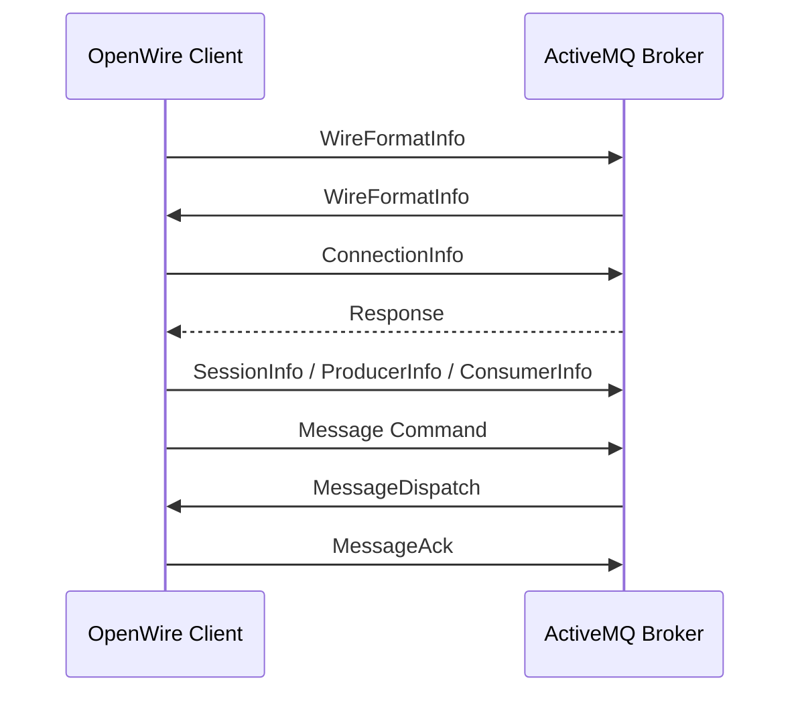

# OpenWire：ActiveMQ 原生二进制协议

> 本页结论：OpenWire 是 ActiveMQ Classic 的原生、高功能二进制线协议，围绕 Command 对象和 JMS 风格 Destination 传输连接、生产、消费、事务与确认信息。它适合完整使用 ActiveMQ 能力，但不是跨厂商开放标准。

## 工作方式

OpenWire 客户端与 Broker 建立连接后，先交换 `WireFormatInfo`，协商双方支持的协议版本和编码选项，再发送 Connection、Session、Producer、Consumer 与 Message 等 Command。

多数 Command 可以单向发送，需要确认或查询时使用 Request/Response。编码为二进制，适合客户端库高效处理，但不像 STOMP 文本 Frame 那样便于人工阅读。

## 为什么 ActiveMQ 客户端偏爱 OpenWire

- 能较完整地表达 ActiveMQ Classic 的 Queue、Topic、Durable Subscription 和事务等能力。
- 与 ActiveMQ Java 客户端和 JMS 模型结合紧密。
- 支持协议版本与编码特性协商。
- 有 Java、C#、C++ 等客户端实现路径。

## 与其他协议的选择

| 需求 | 更合适的入口 |
| --- | --- |
| ActiveMQ Classic 原生 Java/JMS 功能 | OpenWire |
| 跨厂商企业消息互操作 | [AMQP 1.0](/reference/protocols/amqp-10) |
| 简单文本协议、多语言易实现 | [STOMP](/reference/protocols/stomp) |
| IoT、弱网、设备 Topic/QoS | [MQTT](/reference/protocols/mqtt) |

OpenWire 客户端能否连接 Artemis，以及具体支持哪些 ActiveMQ 特性，需要以 Artemis 的兼容实现为准；“协议可连接”不代表所有 Broker 扩展都等价。

## 边界

- OpenWire 主要服务 ActiveMQ 生态，不能把它当作任意 Broker 都支持的标准协议。
- 抓包、网关代理和非官方客户端实现成本高于文本型 STOMP。
- JMS 是上层 Java API；JMS Provider 可以使用 OpenWire，但 JMS 本身并不等于 OpenWire。

官方资料：[ActiveMQ OpenWire](https://activemq.apache.org/components/classic/documentation/openwire) · [Wire Protocol](https://activemq.apache.org/components/classic/documentation/wire-protocol)
